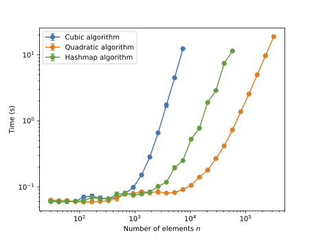
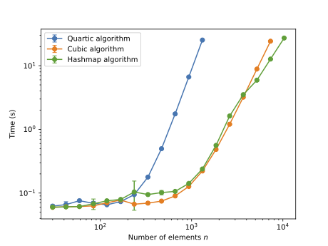

# Three-Sum & Four-Sum Problem Analysis & Benchmarking

The Three-Sum and Four-Sum problem is a classic computer science
challenge in the area of algorithm design and implementation. The
objective of the Three-Sum challenge is to determine if three
distinctive elements exist within a data structure that sum up to zero
when added together. This is extended to one more distinctive element in
the Four-Sum Challenge. The Three-Sum problem satisfies the following
mathematical properties:
$$i, j, k \, (i \neq j, \, i \neq k, \, j \neq k), \, \, x_i + x_j + x_k = 0$$

## Implementation

The implementation of the solutions to the Three-Sum and Four-Sum
problems can be found in the code repository [here](project-files/app/src/main/java/threesum/).

## Time and Space Complexity
The time and space complexity can be seen for all implementations in the
below table: 


## Experiment results
### Three-Sum
The results of the Three-Sum experiment can be seen in the below graph:



### Four-Sum
The results of the Four-Sum experiment can be seen in the below graph:


## How to run the code and experiments

### Requirements:
* Java 17 or higher
* Gradle 7.2 or higher
* Python 3.9 or higher
* JUnit 4 or higher

### Build the gradle project
```bash
./gradlew build
```

### Run the experiments
```bash
python3 results/experiments.py
```

### Run the post-processing
```bash
python3 results/post_processing.py
```

